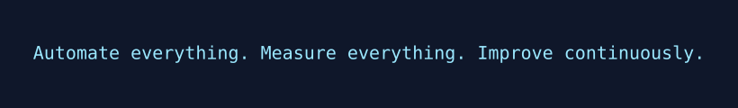

<!-- ================= Header / Banner ================= -->
<p align="center">
  
</p>

<h1 align="center">Bhomesh Razdan</h1>
<p align="center"><strong>DevOps Engineer • Cloud • SRE • Automation</strong></p>

<p align="center">
  <a href="https://www.linkedin.com/in/bhomesh">LinkedIn</a> •
  <a href="mailto:bhomeshrazdan.work@gmail.com">Email</a> •
  <a href="https://github.com/bhomesh">GitHub</a>
</p>

---

## ⚡ Live DevOps Dashboard (auto-updates)
<p align="center">
  <!-- Grafana / Prometheus panel snapshot (generated by action) -->
  
</p>

> The image above is regenerated periodically by GitHub Actions from a Grafana/Prometheus panel (or a custom metrics endpoint).

---

## ✨ Dynamic Quote (changes every update)
<p align="center">
  
</p>

> The `quote_banner.svg` is generated from a rotating quote list and updated automatically.

---

## ☁️ Animated Cloud Architecture
<p align="center">
  <!-- Mermaid-generated diagram -->
  
</p>

> Diagram rendered from `diagrams/cloud-arch.mmd` (Mermaid). The workflow creates a crisp SVG/PNG.

---

## 🎧 Now Playing / Currently Learning
<p align="center">
   &nbsp;
  
</p>

> Now playing is pulled from Last.fm / other source and `currently_learning` is a small list you keep in `data/learning.yml`.

---

## 🖥️ Terminal-style Landing
<p align="center">
  <!-- animated terminal GIF generated by Action -->
  
</p>

```bash
# Example terminal text shown in the landing GIF:
$ whoami
bhomeshrazdan
$ echo "deploying infra with terraform..."
deploy: success  ✅
$ watching: kube-operator | grafana | promo
