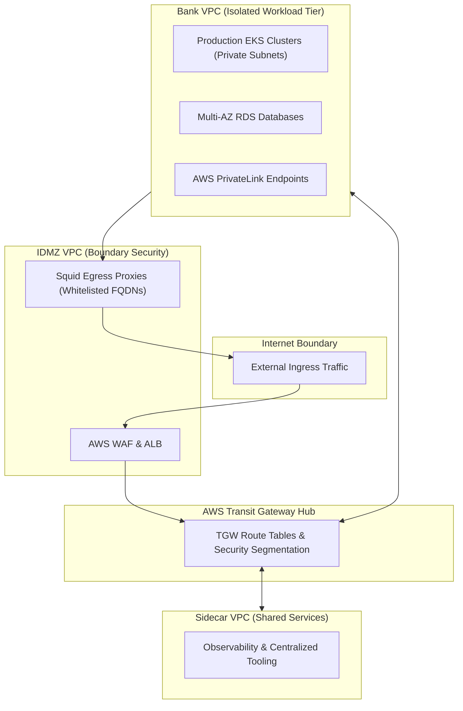

<!-- ================================================================= -->
<!--                   BHOMESH RAZDAN // DEVOPS HUD                  -->
<!--      Enterprise Cloud Architect • DevSecOps • Platform Engineer  -->
<!-- ================================================================= -->

<div align="center">

<!-- Futuristic Cyber Dynamic Header Banner -->


<!-- Real-Time Typing SVG -->
<a href="https://git.io/typing-svg">
  
</a>

<p align="center">
  <a href="mailto:bhomeshrazdan.work@gmail.com"></a>
  <a href="https://www.linkedin.com/in/bhomesh"></a>
  <a href="https://github.com/bhomesh"></a>
  <a href="https://medium.com/@BhomeshRazdan"></a>
  
</p>

<p align="center">
  
</p>

</div>

---

### 🛰️ MISSION CONTROL // TELEMETRY & SYSTEM METRICS

```yaml
root@antigravity-core:~# cat /etc/bhomesh/system.telemetry
========================================================================================
ENGINEER_NAME       : Bhomesh Razdan
SYSTEM_CLASS        : DevOps Engineer // Cloud Platform & DevSecOps Specialist
EXPERIENCE_VECTOR   : 3+ Years Operating Production AWS Infrastructure & Kubernetes Fleets
PRODUCTION_FLEET    : 8+ Multi-Tenant AWS EKS Clusters (IRSA, Helm, Istio mTLS, ArgoCD)
SECURITY_PERIMETER  : Zero-Trust Multi-VPC (Transit Gateway, Squid Egress, PrivateLink)
SUPPLY_CHAIN_GATES  : Wiz Platform, CIAS Dynamic Scanning, Sonatype Nexus Intake/Trusted
RELIABILITY_METRIC  : Mean Time to Resolution (MTTR) Cut from 3.8h -> 2.3h (-39.5%)
CORE_DISCIPLINES    : Infrastructure as Code (IaC), GitOps, Cloud Networking & Observability
========================================================================================
```

---

### 📊 OPERATIONAL IMPACT AT A GLANCE

<div align="center">
<table>
  <tr>
    <td align="center" width="25%">
      <h3>📉 -39.5%</h3>
      <p><b>MTTR Reduction</b><br/>Dropped downtime from 3.8h to 2.3h with Datadog APM & automated runbooks</p>
    </td>
    <td align="center" width="25%">
      <h3>☸️ 8+ Clusters</h3>
      <p><b>Production EKS Fleet</b><br/>Zero-downtime upgrades from v1.23 to v1.32 with Istio mTLS</p>
    </td>
    <td align="center" width="25%">
      <h3>⚡ 0.5d ➔ Min</h3>
      <p><b>Supply Chain Cycle</b><br/>Automated Wiz & CIAS image promotion, eliminating Jira wait queues</p>
    </td>
    <td align="center" width="25%">
      <h3>💰 60% Savings</h3>
      <p><b>Compute Optimization</b><br/>Autoscaling Spot runners with pre-baked Packer AMIs (-40% boot time)</p>
    </td>
  </tr>
</table>
</div>

---

### ⚡ ARCHITECTURAL BLUEPRINTS

#### 1. Enterprise Multi-VPC Zero-Trust Network Topology
*Securing core banking workloads with zero direct internet access, strict boundary inspection, and PrivateLink ingress.*


```mermaid
flowchart TD
    subgraph WAN ["Internet Boundary"]
        Internet["External Ingress Traffic"]
    end

    subgraph IDMZ ["IDMZ VPC (Boundary Security)"]
        WAF["AWS WAF & ALB"]
        Squid["Squid Egress Proxies (Whitelisted FQDNs)"]
    end

    subgraph TGW ["AWS Transit Gateway Hub"]
        TGW_Core["TGW Route Tables & Security Segmentation"]
    end

    subgraph BankVPC ["Bank VPC (Isolated Workload Tier)"]
        EKS_Fleet["Production EKS Clusters (Private Subnets)"]
        RDS_Cluster["Multi-AZ RDS Databases"]
        PrivateLink["AWS PrivateLink Endpoints"]
    end

    subgraph SidecarVPC ["Sidecar VPC (Shared Services)"]
        Shared_Services["Observability & Centralized Tooling"]
    end

    Internet --> WAF
    WAF --> TGW_Core
    TGW_Core <--> BankVPC
    TGW_Core <--> SidecarVPC
    BankVPC --> Squid
    Squid --> Internet
```

#### 2. Autonomous Container Image Hydration Supply Chain
*Automated vulnerability gating from developer commit to trusted production deployment.*


```mermaid
flowchart LR
    DevCommit["Developer Commit"] --> GHAction["GitHub Actions Build"]
    GHAction --> Wiz["Wiz Security Scan"]
    Wiz --> NexusIntake["Nexus Intake Registry"]
    NexusIntake --> EC2Bot["Scheduled EC2 Automation Engine"]
    EC2Bot --> CIAS["CIAS Deep Vulnerability Scan"]
    CIAS -->|Passed| NexusTrusted["Nexus Trusted Registry"]
    NexusTrusted --> ArgoCD["ArgoCD GitOps Engine"]
    ArgoCD --> ProdEKS["Production AWS EKS Clusters"]
```

---

### 🛡️ TECHNICAL ARSENAL & TOOLING MATRIX

<table>
  <tr>
    <td width="50%" valign="top">
      <h4>☁️ Cloud Platforms & Core Services</h4>
      <p>
        
        
        
        
        
        
        
        
        
        
        
        
      </p>
      <h4>⚙️ Infrastructure as Code & Automation</h4>
      <p>
        
        
        
        
        
      </p>
      <h4>☸️ Containers, Orchestration & Mesh</h4>
      <p>
        
        
        
        
        
      </p>
    </td>
    <td width="50%" valign="top">
      <h4>🔒 DevSecOps, Vulnerability Scanning & Compliance</h4>
      <p>
        
        
        
        
        
        
        
      </p>
      <h4>🚀 CI/CD Pipelines & GitOps Release Engineering</h4>
      <p>
        
        
        
        
      </p>
      <h4>📊 Telemetry, APM & Observability</h4>
      <p>
        
        
        
        
      </p>
      <h4>💻 Scripting, Systems & Glue Code</h4>
      <p>
        
        
        
        
      </p>
    </td>
  </tr>
</table>

---

### 🛠️ HOW I OPERATE // ENGINEERING PRINCIPLES

- **Zero-Trust by Default:** Enforce least-privilege IAM, VPC endpoint policies, and mTLS between microservices. Never assume trust inside internal networks.
- **Git as the Single Source of Truth:** Deploy everything through declarative GitOps (ArgoCD) and modular Terraform with remote state locking to eliminate drift.
- **Automated Security Gates:** Shift security left by baking Wiz, Snyk, CIAS, and Trivy directly into the deployment stream rather than treating audits as an afterthought.
- **Data-Driven Observability:** Monitor service level indicators with Prometheus and Datadog APM; prioritize actionable alerts backed by verified incident runbooks.

---

### ⏱️ CAREER TIMELINE & COMBAT EXPERIENCE

```
  2023                        2024                        2025                       2026+
  ┌───────────────────────────┬───────────────────────────┬───────────────────────────►
  │ PDEIndia (DevOps Intern)  │ Clouddrove (Assoc. DevOps)│ Zynsera Tech (DevOps Eng) │
  │ • Bash & GH Actions       │ • EKS v1.23 -> v1.32      │ • Bank Multi-VPC Security │
  │ • Terraform AWS Basics    │ • Zero-Downtime Jenkins   │ • Wiz/Nexus/CIAS Pipeline │
  │ • Jenkins Operations      │ • EventBridge & Lambda    │ • 8+ EKS Clusters | Istio │
```

#### 🔹 **Zynsera Technology** | *DevOps Engineer* `[May 2025 – Present]`
> **Domain:** Enterprise Banking Cloud Security, Zero-Trust Multi-VPC & Supply Chain Governance
- 🛡️ **Enterprise Multi-VPC Isolation:** Implemented complete network segmentation (**Bank VPC**, **IDMZ VPC**, **Sidecar VPC**) interconnected via **AWS Transit Gateway** and **AWS PrivateLink**, with **Squid proxy egress filtering**, eliminating flat network access and internet exposure for internal banking microservices.
- 🔄 **Autonomous Image Hydration Supply Chain:** Built an automated EC2-based container promotion engine (`Wiz Security Scan` ➔ `Nexus Intake` ➔ `CIAS Dynamic Testing` ➔ `Trusted Golden Registry`), replacing a manual per-image Jira approval process and eliminating up to **0.5 days of deployment wait time**.
- ☸️ **EKS Fleet Management:** Operate **8+ production AWS EKS clusters** (IRSA, Helm, ArgoCD GitOps, Istio Service Mesh) with Datadog APM and Prometheus/Grafana monitors, driving down **MTTR from 3.8h to 2.3h**.
- 📦 **Standardized IaC Framework:** Authored reusable **Terraform** modules (VPC, Security Groups, IAM, EKS, RDS, Route 53, ALB, ACM) with **remote state locking** across AWS/Azure; integrated Snyk/SonarCloud/Trivy gates into CI/CD to eliminate configuration drift.

#### 🔹 **Clouddrove** | *Associate DevOps Engineer* `[May 2024 – April 2025]`
> **Domain:** Kubernetes Fleet Modernization, Zero-Downtime Migration & Operational Automation
- 🚀 **Zero-Downtime EKS Upgrades:** Upgraded production Kubernetes clusters across **v1.23 ➔ v1.32** throughout Dev, Staging, and Production tiers with automated pre-flight add-on compatibility verification.
- 🏗️ **CI/CD Platform Modernization:** Led a major zero-downtime **Jenkins platform overhaul**, migrating legacy shell automation into containerized declarative **GitHub Actions** workflows and Helm releases secured by **Istio mTLS**.
- ⚡ **Cloud Operations Automation:** Engineered automated operational scripts using **Python** & **Bash** integrated with **AWS EventBridge**, **Lambda**, **SSM Run Command**, and **Parameter Store**.

#### 🔹 **PDEIndia** | *DevOps Intern* `[May 2023 – April 2024]`
> **Domain:** CI/CD Foundations, Infrastructure Provisioning & Build Orchestration
- 🛠️ Scripted custom Bash routines for GitHub Actions workflows, managed Jenkins build nodes, and provisioned immutable AWS cloud resources (EC2, S3, IAM, Security Groups) via Terraform under senior architectural supervision.

---

### 🧩 FLAGSHIP ENGINEERING PROJECTS

<table>
  <tr>
    <td width="50%">
      <h3>⚡ Self-Hosted GitHub Runner Automation</h3>
      <p><b>Stack:</b> Terraform • AWS Auto Scaling • HashiCorp Packer • Spot Instances</p>
      <ul>
        <li>Architected dynamically autoscaling GitHub Actions self-hosted runners on AWS EC2.</li>
        <li>Pre-baked CI runtimes into immutable AMIs with Packer, cutting job boot time by <b>40%</b>.</li>
        <li>Implemented intelligent Spot Instance bidding, slashing compute expenditures by <b>60%</b>.</li>
      </ul>
    </td>
    <td width="50%">
      <h3>🛡️ Automated RDS Disaster Recovery & Validation</h3>
      <p><b>Stack:</b> AWS Lambda • Python / Boto3 • EventBridge • Slack API</p>
      <ul>
        <li>Automated snapshot verification, isolated test instance restore, and integrity checks.</li>
        <li>Cut manual operational disaster recovery drills from <b>2 hours down to 10 minutes</b>.</li>
        <li>Containerized serverless Lambdas with automated reporting pipelines into Slack and Jira.</li>
      </ul>
    </td>
  </tr>
</table>

---

### ✍️ TECHNICAL WRITING & DISPATCHES

<div align="center">
  <a href="https://medium.com/@BhomeshRazdan/supercharge-your-zsh-setup-with-these-essential-plugins-2d3dfbb7cec0">
    
  </a>
</div>

---

### 📈 TELEMETRY METRICS & CODE FREQUENCY

<div align="center">
  <table border="0">
    <tr>
      <td>
        
      </td>
      <td>
        
      </td>
    </tr>
  </table>

  <!-- Streak Stats Card -->
  <p align="center">
    
  </p>
</div>

---

### 📡 INITIATE SECURE TRANSMISSION

<div align="center">

```
 ╔═══════════════════════════════════════════════════════════════════════════════════╗
 ║           READY TO COLLABORATE ON HIGH-SCALE CLOUD & INFRASTRUCTURE?              ║
 ║      Open for Senior DevOps, Cloud Infrastructure & DevSecOps Opportunities       ║
 ╚═══════════════════════════════════════════════════════════════════════════════════╝
```

<p align="center">
  <a href="mailto:bhomeshrazdan.work@gmail.com">
    
  </a>
  &nbsp;&nbsp;
  <a href="https://www.linkedin.com/in/bhomesh">
    
  </a>
  &nbsp;&nbsp;
  <a href="https://medium.com/@BhomeshRazdan">
    
  </a>
</p>

<!-- Footer Wave -->


</div>
